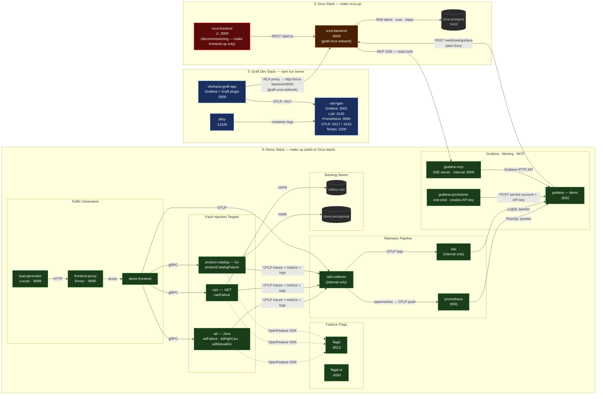

# Architecture — Container & Service Map

## Stack Overview

The full system spans three Docker Compose stacks connected via a shared `graft-orca` Docker network.

| Stack | Started by | Purpose |
|-------|-----------|---------|
| **① Graft Dev** | `npm run server` | Grafana with the Graft plugin loaded for UI development |
| **② Orca** | `cd services/orca && make orca-up` | RCA backend + database |
| **③ Demo** | `cd services/orca && make up` | OTel demo services that generate real alerts to drive Orca |

---

## Service Map

---

## Port Allocation

All previous host-port conflicts between the Graft dev stack and the Orca+Demo stack have been resolved.

| Port | Container | Stack |
|------|-----------|-------|
| **3000** | `vikshana-graft-app` (Grafana + Graft plugin) | ① Graft dev |
| **3001** | `otel-lgtm` (Grafana) | ① Graft dev |
| **3002** | `grafana` (demo alerts + dashboards) | ③ Demo |
| **3100** | `otel-lgtm` (Loki) | ① Graft dev |
| **3200** | `otel-lgtm` (Tempo) | ① Graft dev |
| **4317/4318** | `otel-lgtm` (OTLP) | ① Graft dev |
| **5432** | `orca-postgres` | ② Orca |
| **8000** | `orca-backend` | ② Orca |
| **8080** | `frontend-proxy` (Envoy) | ③ Demo |
| **9090** | `otel-lgtm` (Prometheus) | ① Graft dev |
| **9091** | `prometheus` | ③ Demo |
| **12345** | `alloy` | ① Graft dev |

> `loki` and `otel-collector` in the demo stack have no host port binding — they are accessed only via Docker networking by other demo containers.

---

## Use Case Quick Reference

| Goal | Command | Notes |
|------|---------|-------|
| Graft UI development only | `npm run server` | Stack ① only |
| Graft + pre-seeded RCA data | `cd services/orca && make orca-up` then `npm run server` | Stacks ① + ② |
| Orca RCA pipeline (alert → investigation → report) | `cd services/orca && make up` | Stacks ② + ③ — `make init` required first time |
| **Full E2E: Graft displaying live Orca RCAs** | `cd services/orca && make up` then `npm run server` | All stacks — `graft-orca` network created automatically by both commands |
| Legacy Orca frontend | `cd services/orca && make frontend-up` | Deprecated — use Graft plugin UI instead |

---

## Known Gaps

1. **`orca-frontend` port collision** — Orca's Next.js dashboard (`make frontend-up`) still uses `:3000`, which clashes with Graft's Grafana if both are started simultaneously. `orca-frontend` is being decommissioned in favour of the Graft plugin UI and is excluded from `make up` / `make orca-up`.
