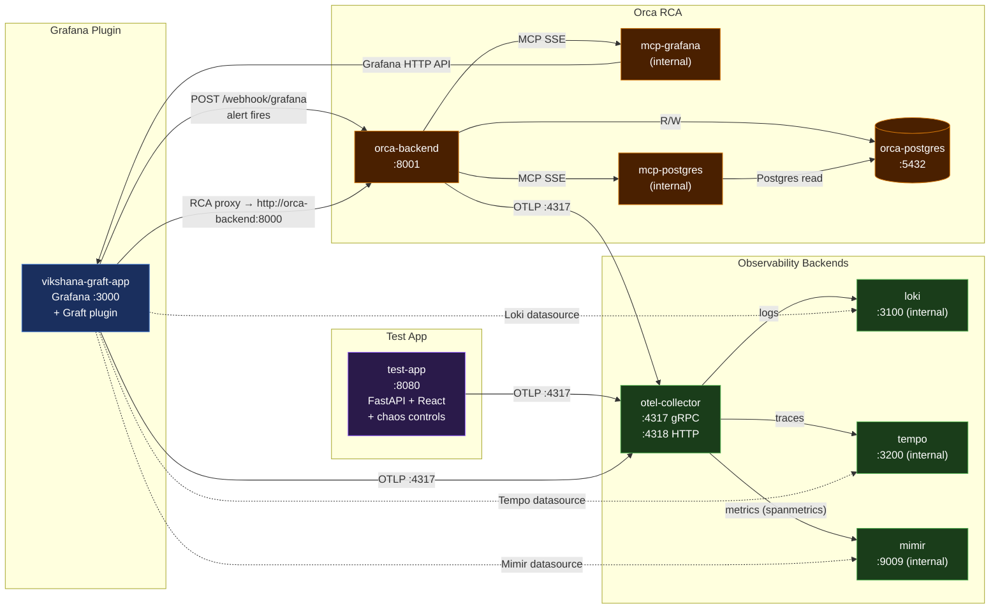

# Architecture

## Overview

The Graft development environment is a **single Docker Compose stack**. All services share the default Docker network and communicate by container name. One Grafana instance hosts the plugin; separate containers handle each observability concern.

```
npm run server   →   docker compose up --build
```

---

## Service Map



---

## Port Allocation

| Port | Container | Purpose |
|------|-----------|---------|
| **3000** | `grafana` (`vikshana-graft-app`) | Grafana + Graft plugin |
| **4317** | `otel-collector` | OTLP gRPC receiver |
| **4318** | `otel-collector` | OTLP HTTP receiver |
| **5432** | `orca-postgres` | PostgreSQL |
| **8001** | `orca-backend` | Orca RCA API |
| **8080** | `test-app` | Test app (API + chaos UI) |

Internal-only (no host port): `loki:3100`, `tempo:3200`, `mimir:9009`, `mcp-grafana`, `mcp-postgres`

---

## RCA Pipeline

```
test-app UI  →  toggle chaos (error/latency/exception)
                     ↓
             HTTP 5xx responses  →  Mimir metrics via OTel
                     ↓
       Grafana alert rule fires after 2m pending
       (provisioning/alerting/alert-rules.yml)
                     ↓
  POST http://orca-backend:8000/webhook/grafana
                     ↓
  Orca spawns LangGraph agent (Haiku triage, Sonnet investigate)
  Agent queries Grafana (mcp-grafana) + Postgres (mcp-postgres)
                     ↓
  RCA report saved to orca-postgres
  Accessible: Grafana → Apps → Graft → RCA
```

---

## Plugin Loading

| Volume Mount | Purpose |
|---|---|
| `./dist` → `/var/lib/grafana/plugins/vikshana-graft-app` | Compiled plugin files |
| `./provisioning` → `/etc/grafana/provisioning` | Datasources, alerting, plugin config |

```bash
npm run build          # Build frontend (webpack)
mage -v                # Build Go backend binary
npm run server         # Start full stack
```

---

## Test App

`services/test-app/` — single container, FastAPI backend + React frontend:

- Business endpoints: `/api/orders`, `/api/products`, `/api/users`
- Chaos endpoints: `POST /api/chaos/enable?type=error|latency|exception`, `POST /api/chaos/disable`
- OTel auto-instrumentation sends traces, metrics, and logs to the collector
- Frontend at `http://localhost:8080` — API status panel + chaos controls

---

## Configuration Files

| File | Purpose |
|------|---------|
| `config/loki.yaml` | Loki single-process config |
| `config/tempo.yaml` | Tempo with metrics generator |
| `config/mimir.yaml` | Mimir single-binary config |
| `config/otel-collector.yaml` | Collector pipelines (traces/metrics/logs) |
| `provisioning/datasources/datasources.yaml` | Mimir, Loki, Tempo datasources |
| `provisioning/alerting/alert-rules.yml` | Test-app alert rules |
| `provisioning/alerting/contact-points.yml` | Orca webhook contact point |
| `provisioning/plugins/apps.yaml` | Graft plugin pre-enablement |

---

## Orca Standalone

For backend-only development (no Grafana, no test app):

```bash
cd services/orca
make up      # starts orca-postgres + orca-backend
make down    # stops them
make trigger-rca SERVICE=test-app ALERT=TestAppHighErrorRate
```
