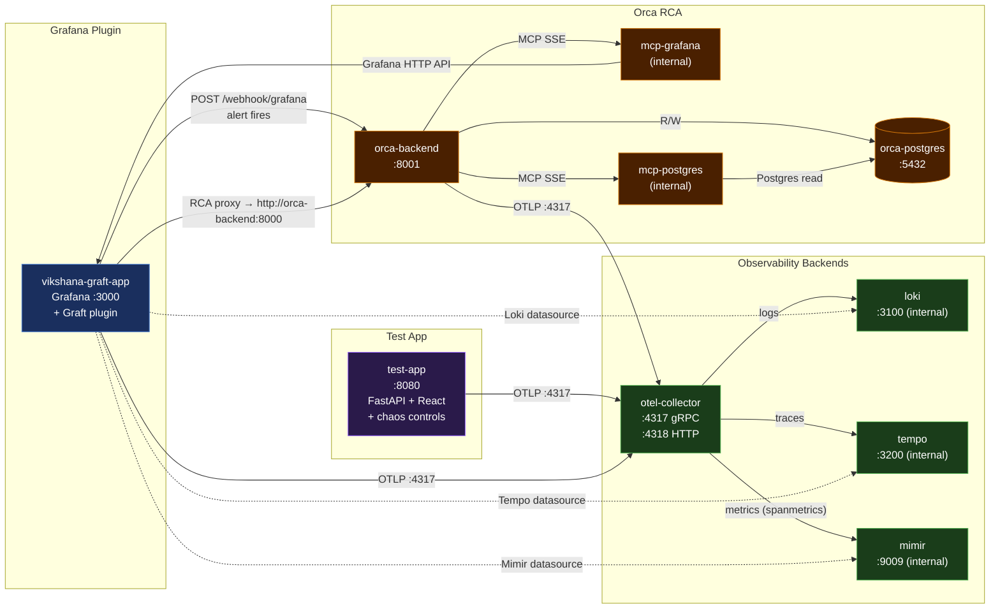

# Architecture

This is the canonical, high-level architecture overview for Graft. It covers
the two-system topology (Grafana plugin ↔ Orca backend), the trust boundary
and HMAC contract between them, schema/concurrency/tool-execution invariants
inside Orca, and where to find deeper detail. The local Docker Compose dev
environment (service map, ports, config files) follows further down.

For Orca-internal detail (data model, legacy 5-node webhook graph, MCP
integration internals) see `services/orca/docs/architecture.md`. For the
design rationale behind specific decisions see `docs/decisions/` (ADRs) and
`docs/harness-risk-review.md` (security/robustness findings and their
resolution status).

## Contents

- [System Topology: Two Independent Systems](#system-topology-two-independent-systems)
- [Go Gateway ↔ Orca Trust Boundary](#go-gateway--orca-trust-boundary)
- [HMAC Internal-Auth Contract](#hmac-internal-auth-contract)
- [Schema Authority: Alembic Only](#schema-authority-alembic-only)
- [TurnWorker Concurrency Model](#turnworker-concurrency-model)
- [Guarded Tool Execution](#guarded-tool-execution)
- [Org Scoping & MCP Tool Registry Replication](#org-scoping--mcp-tool-registry-replication)
- [Testing](#testing)
- [Development Environment (Docker Compose)](#development-environment-docker-compose)

---

## System Topology: Two Independent Systems

Graft is composed of two systems that deploy, scale, and fail independently:

1. **Grafana plugin** — `src/` (React frontend) + `pkg/plugin/` (Go backend).
   The trusted gateway. Browser requests are authenticated as Grafana users;
   `/sessions/*` and `/mcp/*` also receive plugin RBAC before reaching Orca.
   The `/rca/*` proxy is HMAC-signed but currently has no plugin RBAC
   middleware.
2. **Orca backend** — `services/orca/backend/` (Python, FastAPI + LangGraph).
   The agent harness: owns the RCA/investigation graph, the guard pipeline,
   the MCP tool registry, and its own Postgres database. It is never reachable
   directly by the browser in a correctly configured deployment — only the
   Go gateway proxies to it.

```
Browser ──(Grafana session auth)──▶ Grafana plugin (Go, pkg/plugin/)
                                          │ RBAC check (agent_allowed_roles)
                                          │ injects X-Grafana-Org-Id
                                          │ HMAC-signs every request
                                          ▼
                                    Orca backend (Python, services/orca/backend/)
                                          │ InternalAuthMiddleware validates
                                          │ HMAC before any handler runs
                                          ▼
                              TurnWorker · GuardPipeline · MCP tool registry
```

## Go Gateway ↔ Orca Trust Boundary

The Go plugin backend (`pkg/plugin/`) is the **only intended caller** of
Orca's internal API surface: `/api/sessions`, `/api/mcp`, `/api/identity`,
`/api/rca`. Three layers enforce this:

1. **RBAC at the gateway.** `pkg/plugin/session_proxy.go` reads
   `agent_allowed_roles` from the plugin's `jsonData` (default
   `["Admin", "Editor"]`) and rejects disallowed Grafana roles before
   proxying `/sessions/*` and `/mcp/*`. `/rca/*` does not currently use this
   middleware.
2. **Org identity injected, not client-supplied.** The gateway sets
   `X-Grafana-Org-Id` from the authenticated `PluginContext` — a client
   cannot forge this by sending its own header.
3. **HMAC-SHA256 request signing** (below) — every proxied request is signed
   by the gateway (`pkg/plugin/internal_signer.go`) and verified by Orca's
   `InternalAuthMiddleware` (`services/orca/backend/harness/auth/internal_auth.py`)
   before any route handler runs.

## HMAC Internal-Auth Contract

```
X-Agent-Signature: HMAC-SHA256(method:timestamp:nonce:target:body_sha256:org_id, secret)
X-Agent-Timestamp: <unix timestamp>
X-Agent-Nonce:     <random per-request token>
```

- **`target`** is the raw, percent-encoded path plus raw query string exactly
  as transmitted on the wire — Go's `req.URL.EscapedPath()` and Python's ASGI
  `raw_path`, never the decoded path — so both sides canonicalise on
  identical bytes.
- **Freshness window:** 30s. Requires the Go host/container and the Orca
  host/container to be NTP-synced to within a few seconds.
- **Replay defense:** the nonce is bound into the signed message and checked
  against an in-memory, bounded (10k entries), TTL-expiring (90s) cache
  scoped to a **single Orca process**. MCP runtime state supports bounded
  multi-replica convergence, but replay prevention remains per replica;
  deployments requiring cluster-wide replay prevention need a shared nonce
  store (for example Redis), which is not implemented yet.
- **Shared secret:** both sides read `AGENT_INTERNAL_SECRET`. Empty (the
  default) disables signing entirely — a transparent dev-mode pass-through.
  Orca's `Settings.validate_production_secrets()` refuses to start when
  `ENVIRONMENT=production` and the secret (or either encryption key) is
  empty; the Go side has no equivalent "production" flag and only logs a
  warning, so operators must set the secret intentionally on both sides.
- **Protected prefixes:** `/api/sessions`, `/api/mcp`, `/api/identity`, and
  `/api/rca` — all four now carry HMAC signing; `/api/rca` previously
  bypassed it.

Full detail: `services/orca/README.md` § Internal Authentication (HMAC).

## Schema Authority: Alembic Only

Orca's schema is owned exclusively by Alembic:

- `services/orca/backend/docker-entrypoint.sh` runs `alembic upgrade head`
  before `uvicorn` starts in the container.
- `app/main.py` no longer calls `Base.metadata.create_all` or runs ad-hoc
  `ALTER TABLE ... ADD COLUMN IF NOT EXISTS` at startup.
- `app/schema_check.py` is a defense-in-depth check: on every startup it
  compares the database's recorded Alembic revision against the packaged
  head revision. In production (`ENVIRONMENT=production`) a mismatch raises
  and refuses to serve traffic; in development it only logs a warning, so a
  bare-metal `uvicorn --reload` workflow that hasn't migrated yet still
  starts.
- Bare-metal / local dev: run `alembic upgrade head` once, and again after
  pulling new migrations.

## TurnWorker Concurrency Model

`harness/session/worker.py`'s `TurnWorker` polls `turn_jobs`
(`FOR UPDATE SKIP LOCKED`) and executes at most one active turn per session:

1. **Claim** a pending job on a pooled connection, committed immediately —
   the claim is durable regardless of how long the turn itself takes.
2. **Serialize per-session** with a *non-blocking*, transaction-scoped
   `pg_try_advisory_xact_lock(hashtext(session_id))`, acquired on a dedicated
   execution connection (never the pooled claim connection). If the lock is
   unavailable (another worker/replica is already executing a turn for this
   session), the job is immediately requeued to `pending` rather than
   blocking the poll loop or holding a pooled connection hostage.
3. **Heartbeat** while executing: a background task refreshes `claimed_at`
   every `TURN_JOB_HEARTBEAT_INTERVAL_S` (default 60s) so a legitimately
   long-running turn is never mistaken for a crashed one.
4. **Orphan reaping:** a job stuck in `claimed` past `TURN_JOB_LEASE_TTL_S`
   (default 600s) with no heartbeat is reset to `pending`, or marked
   `failed` once `TURN_JOB_MAX_ATTEMPTS` (default 5) is exceeded.

Because the lock is transaction-scoped, it is released purely by ending that
one transaction (commit or rollback) — there is no separate unlock statement
that itself has to round-trip successfully, so a crashed or cancelled turn
can never leave a session's lock permanently held. See
[ADR-003](docs/decisions/ADR-003-worker-queue.md).

## Guarded Tool Execution

The live investigation graph (`app/agent/rca_graph.py`) routes every
LLM-initiated tool call through `GuardedToolExecutor`
(`harness/tools/bridge.py`) instead of invoking LangChain tools directly:

- Every call is evaluated against `GuardPipeline` (RBAC, PII redaction, Cost,
  Budget, Timeout, Write-approval, Loop) before it runs.
- Tool names not present in the caller-scoped registry raise
  `ToolNotRegisteredError` — they are never silently executed.
- Tool calls run under a per-tool wall-clock timeout; exceptions are
  classified (`harness/tools/error_classification.py`) rather than defaulting
  every failure to retryable.
- **No approval flow is wired in.** A tool call that resolves to
  `ApprovalRequired` (write-class tools) is refused outright with a message
  back to the LLM — the call is never executed, but there is no
  human-approval consumer connected to this executor. Today no write-class
  tool is registered on the live RCA path, so this is defense-in-depth for a
  future write tool, not an active approval UX.
- Real tool names (including org-qualified MCP names) are exposed to the LLM
  as short, collision-safe wire aliases (`harness/tools/naming.py`, ≤64
  chars) and resolved back to the real name before dispatch.

## Org Scoping & MCP Tool Registry Replication

- **Registry keys are org-qualified:** `mcp:{org_id}:{server_name}:{tool_name}`
  (`harness/mcp/models.py`). Two orgs naming a server identically no longer
  collide in the process-global tool registry; wire aliases (above) are a
  separate, LLM-facing concern from this org-qualified registry key.
- **`MCPClientManager` state is per-replica, in-memory; Postgres is the
  source of truth.** Each replica converges independently via `reconcile()`:
  - A bounded periodic background loop (`MCP_RECONCILE_INTERVAL_S`, default
    30s).
  - An on-access TTL check (`MCP_RECONCILE_TTL_S`, default 10s) from the
    `/api/mcp/*` read/write paths, so a request landing on a replica shortly
    after another replica's add/toggle/reconnect/delete still observes the
    change without waiting for the next periodic tick.
  - **This bounds staleness; it is not immediate or synchronous
    cross-replica propagation.** There is no LISTEN/NOTIFY or push
    mechanism — worst case a replica can lag by `MCP_RECONCILE_INTERVAL_S`.
- **Encryption fails closed.** MCP bearer tokens and OBO refresh tokens are
  Fernet-encrypted. A decrypt failure (malformed ciphertext or a rotated key)
  raises `TokenDecryptionError` — the manager never falls back to sending
  ciphertext as a bearer token; the affected server/tool is left
  disconnected/disabled instead.

See [ADR-007](docs/decisions/ADR-007-mcp-architecture.md) for full design
rationale.

## Testing

| Suite | Command | Where |
|---|---|---|
| Frontend unit | `npm run test:ci` | repo root |
| Go | `go test ./pkg/...` | repo root |
| Python (Orca harness) | `pytest tests/unit/ tests/llm/ tests/security/ tests/characterization/ --cov=harness --cov-fail-under=85 -q` | `services/orca/backend/` |
| E2E | `npm run e2e` (requires `npm run server` running) | repo root |

**Known CI gap:** `.github/workflows/ci.yml` runs the frontend unit tests, the
Go tests, and Python dependency/vulnerability scans (`pip-audit`,
`govulncheck`) — it does **not** invoke `pytest` for
`services/orca/backend/tests/` anywhere in CI. The Python suite above must be
run manually/locally; it is not part of any CI gate today.

---

## Development Environment (Docker Compose)

The local dev environment is a **single Docker Compose stack**. All services
share the default Docker network and communicate by container name. One
Grafana instance hosts the plugin; separate containers handle each
observability concern and the Orca backend described above.

```
npm run server   →   docker compose up --build
```

---

## Service Map


```mermaid
flowchart LR
    classDef grafanaNode fill:#1a2f5e,stroke:#4a7fd4,color:#fff
    classDef observNode  fill:#1a3d1a,stroke:#4aaa4a,color:#fff
    classDef orcaNode    fill:#4a2000,stroke:#d4770a,color:#fff
    classDef testNode    fill:#2a1a4a,stroke:#9a66ff,color:#fff
    classDef storeNode   fill:#2a2a2a,stroke:#777,color:#ccc

    subgraph PLUGIN["Grafana Plugin"]
        GRAFANA["vikshana-graft-app\nGrafana :3000\n+ Graft plugin"]
    end

    subgraph OBS["Observability Backends"]
        LOKI["loki\n:3100 (internal)"]
        TEMPO["tempo\n:3200 (internal)"]
        MIMIR["mimir\n:9009 (internal)"]
        COLLECTOR["otel-collector\n:4317 gRPC\n:4318 HTTP"]
    end

    subgraph ORCA["Orca RCA"]
        ORCA_BE["orca-backend\n:8001"]
        ORCA_PG[("orca-postgres\n:5432")]
        MCP_G["mcp-grafana\n(internal)"]
        MCP_P["mcp-postgres\n(internal)"]
    end

    subgraph TEST["Test App"]
        APP["test-app\n:8080\nFastAPI + React\n+ chaos controls"]
    end

    %% Telemetry flows
    APP      -->|"OTLP :4317"| COLLECTOR
    GRAFANA  -->|"OTLP :4317"| COLLECTOR
    ORCA_BE  -->|"OTLP :4317"| COLLECTOR

    COLLECTOR -->|"traces"| TEMPO
    COLLECTOR -->|"metrics (spanmetrics)"| MIMIR
    COLLECTOR -->|"logs"| LOKI

    %% Grafana datasources
    GRAFANA -.->|"Mimir datasource"| MIMIR
    GRAFANA -.->|"Loki datasource"| LOKI
    GRAFANA -.->|"Tempo datasource"| TEMPO

    %% Alerting → Orca
    GRAFANA -->|"POST /webhook/grafana\nalert fires"| ORCA_BE

    %% Orca internal
    ORCA_BE -->|"R/W"| ORCA_PG
    ORCA_BE -->|"MCP SSE"| MCP_G
    ORCA_BE -->|"MCP SSE"| MCP_P
    MCP_G   -->|"Grafana HTTP API"| GRAFANA
    MCP_P   -->|"Postgres read"| ORCA_PG

    %% Plugin → Orca proxy
    GRAFANA -->|"RCA proxy → http://orca-backend:8000"| ORCA_BE

    class GRAFANA grafanaNode
    class LOKI,TEMPO,MIMIR,COLLECTOR observNode
    class ORCA_BE,ORCA_PG,MCP_G,MCP_P orcaNode
    class APP testNode
```

---

## Port Allocation

| Port | Container | Purpose |
|------|-----------|---------|
| **3000** | `grafana` (`vikshana-graft-app`) | Grafana + Graft plugin |
| **4317** | `otel-collector` | OTLP gRPC receiver |
| **4318** | `otel-collector` | OTLP HTTP receiver |
| **5432** | `orca-postgres` | PostgreSQL |
| **8001** | `orca-backend` | Orca RCA API |
| **8080** | `test-app` | Test app (API + chaos UI) |

Internal-only (no host port): `loki:3100`, `tempo:3200`, `mimir:9009`, `mcp-grafana`, `mcp-postgres`

---

## RCA Pipeline

```
test-app UI  →  toggle chaos (error/latency/exception)
                     ↓
             HTTP 5xx responses  →  Mimir metrics via OTel
                     ↓
       Grafana alert rule fires after 2m pending
       (provisioning/alerting/alert-rules.yml)
                     ↓
  POST http://orca-backend:8000/webhook/grafana
                     ↓
  Orca spawns LangGraph agent (Haiku triage, Sonnet investigate)
  Agent queries Grafana (mcp-grafana) + Postgres (mcp-postgres)
                     ↓
  RCA report saved to orca-postgres
  Accessible: Grafana → Apps → Graft → RCA
```

---

## Plugin Loading

| Volume Mount | Purpose |
|---|---|
| `./dist` → `/var/lib/grafana/plugins/vikshana-graft-app` | Compiled plugin files |
| `./provisioning` → `/etc/grafana/provisioning` | Datasources, alerting, plugin config |

```bash
npm run build          # Build frontend (webpack)
mage -v                # Build Go backend binary
npm run server         # Start full stack
```

---

## Test App

`services/test-app/` — single container, FastAPI backend + React frontend:

- Business endpoints: `/api/orders`, `/api/products`, `/api/users`
- Chaos endpoints: `POST /api/chaos/enable?type=error|latency|exception`, `POST /api/chaos/disable`
- OTel auto-instrumentation sends traces, metrics, and logs to the collector
- Frontend at `http://localhost:8080` — API status panel + chaos controls

---

## Configuration Files

| File | Purpose |
|------|---------|
| `config/loki.yaml` | Loki single-process config |
| `config/tempo.yaml` | Tempo with metrics generator |
| `config/mimir.yaml` | Mimir single-binary config |
| `config/otel-collector.yaml` | Collector pipelines (traces/metrics/logs) |
| `provisioning/datasources/datasources.yaml` | Mimir, Loki, Tempo datasources |
| `provisioning/alerting/alert-rules.yml` | Test-app alert rules |
| `provisioning/alerting/contact-points.yml` | Orca webhook contact point |
| `provisioning/plugins/apps.yaml` | Graft plugin pre-enablement |

---

## Orca Standalone

For backend-only development (no Grafana, no test app):

```bash
cd services/orca
make up      # starts orca-postgres + orca-backend
make down    # stops them
make trigger-rca SERVICE=test-app ALERT=TestAppHighErrorRate
```
