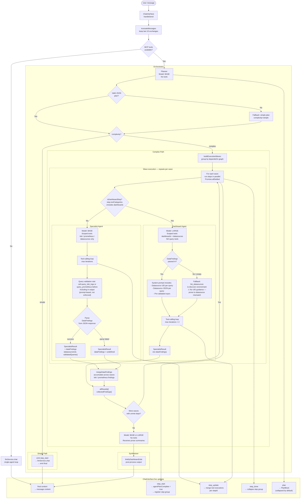

# Graft Multi-Agent Orchestration Flow

## Overview

When a user sends a message in the chat, Graft routes it through a multi-agent
pipeline. The pipeline consists of five components: a **Planner**, one or more
**Specialist** agents, a purpose-built **Dashboard Agent**, a **Synthesiser**,
and the **Orchestrator** that coordinates them all.

For simple requests (single data source, ≤ 2 tool calls), the pipeline short-
circuits to a single-agent loop. For complex requests (multiple data sources,
dashboard creation, or cross-step chaining), the full pipeline runs.

---

## Architecture Diagram



---

## Step-by-Step Explanation

### 1. User Message → ChatInterface

The user sends a message. `handleSend` in `ChatInterface.tsx`:

1. Appends the user message to the conversation history.
2. Calls `truncateMessages(messages, 10)` — keeps at most the last 10
   user/assistant exchanges to stay within the LLM context window.
3. Fetches the current Grafana context (dashboard, user, datasources) and
   formats it into a system prompt string via `formatContext`.
4. Checks whether MCP tools are available (`mcpClient && mcpTools.length > 0`).
   - If no tools: calls `llmService.chat` directly (single-agent loop, no orchestration).
   - If tools available: calls `runOrchestration`.

**Source:** `src/components/features/ChatInterface/ChatInterface.tsx` — `handleSend`

---

### 2. Orchestrator

`runOrchestration` in `orchestrator.ts` is the top-level coordinator.

It receives:
- The truncated message history
- The formatted Grafana context string
- All available MCP tools (already filtered by the user's `ToolsConfig`)
- `modelType` (standard / thinking)
- `maxToolIterations` (from plugin settings, default 50)

It runs four phases sequentially: Plan → Simple or Complex execution → Synthesise.

**Source:** `src/services/agents/orchestrator.ts`

---

### 3. Planner

**Model:** `llm.Model.BASE` — fast, cheap, no tools.

The planner receives the user's message, the Grafana context, and the list of
enabled tool categories. It produces a structured `AgentPlan` as JSON:

```json
{
  "complexity": "simple",
  "reasoning": "Single Loki query to discover log-producing services.",
  "steps": [
    {
      "id": "step_1",
      "description": "Discover Loki labels and identify services producing logs",
      "toolCategories": ["loki"],
      "dependsOn": []
    }
  ]
}
```

**Complexity rules:**

| Complexity | When | What happens next |
|---|---|---|
| `simple` | Single category, ≤ 2 tool calls | Delegates directly to `llmService.chat` |
| `complex` | Multiple categories, chaining, or dashboard creation | Full wave execution |

**Structural rules (prompt-only, not code-enforced):**
- Never produce two steps with the same `toolCategories`.
- Dashboard steps must be separate from data steps and list data steps in `dependsOn`.
- Steps with no `dependsOn` can run in parallel.

**Fallback:** If the model returns invalid JSON, the planner falls back to a
single-step `simple` plan using the first enabled category.

**Source:** `src/services/agents/planner.ts`

---

### 4. Simple Path

When `complexity === 'simple'`:

1. Emits `step_start` — sets the step description in the UI and flips the
   PlanBlock label from "Planning…" to "View plan".
2. Delegates to `llmService.chat` — the existing single-agent tool-calling loop
   with up to `maxToolIterations` iterations.
3. Within `llmService.chat`, after each iteration:
   - Tool results from that iteration are compressed to a short summary before
     the next LLM call to prevent context explosion.
   - Exception: `get_dashboard_by_uid` and related tools are never compressed
     because their output is used directly as input to `update_dashboard`.
4. If `maxToolIterations` is reached, a user-visible note is appended:
   *"The maximum number of tool call steps was reached…"*
5. After `llmService.chat` resolves, emits `final` so `ChatInterface` writes
   the answer to the message.

**Source:** `src/services/agents/orchestrator.ts`, `src/services/llm.ts`

---

### 5. Complex Path — Wave Execution

The orchestrator builds an execution plan from the `dependsOn` dependency graph
using `buildExecutionWaves`. Steps with no unmet dependencies form a "wave"
and run in parallel via `Promise.allSettled`.

For each wave:
1. Emits `step_start` for each step in the wave.
2. Routes each step:
   - `step.toolCategories.includes('dashboards')` → Dashboard Agent
   - Otherwise → Specialist Agent
3. Runs all steps in the wave concurrently. One step failing never blocks others.
4. Merges `DataFindings` from completed data steps into `collectedFindings`.
5. Emits `step_done` for each completed step (triggers UI collapse).
6. Unlocks the next wave once all current-wave dependencies are resolved.

**Source:** `src/services/agents/orchestrator.ts` — `buildExecutionWaves`, wave loop

---

### 6. Specialist Agent

**Model:** `llm.Model.BASE`  
**Tools:** Scoped to the step's `toolCategories` only (e.g. only Loki tools for
a Loki step). Dashboard and cross-category tools are never available.

The specialist runs an internal tool-calling loop (up to `maxToolIterations`).

**For data steps (loki / prometheus), the system prompt is extended with:**

- A **query validation rule**: the model is instructed to call `query_loki_logs`
  (or `query_prometheus`) for each candidate expression before including it in
  its output. *This is prompt-based only — not code-enforced. The model may
  omit the validation call under iteration pressure.*

- A **required JSON output schema**: the specialist must respond with a
  structured `LokiFindings` or `PrometheusFindings` object:

  ```json
  {
    "datasourceUid": "abc123",
    "datasourceName": "Loki",
    "labels": { "service": ["api", "frontend"] },
    "validatedQueries": [
      { "description": "Error rate", "logql": "{service=\"api\"} |= \"error\"" }
    ]
  }
  ```

**Result compression:** After each iteration, prior tool result messages are
replaced with one-line summaries. This prevents the in-loop context window from
growing unboundedly across many tool calls.

**`parseDataFindings`:** After the loop, the specialist's final text response
is parsed as JSON. On success, a `DataFindings` object is attached to the
`SpecialistResult`. On failure (model returned prose instead of JSON),
`dataFindings` is `undefined`.

**Source:** `src/services/agents/specialist.ts`

---

### 7. DataFindings Accumulation

After each wave completes, `mergeDataFindings` is called for each result.
This is a last-write-wins shallow merge:

```ts
{
  loki: incoming.loki ?? accumulated.loki,
  prometheus: incoming.prometheus ?? accumulated.prometheus,
}
```

The merged `collectedFindings` is passed to every dashboard step in subsequent
waves. This is the mechanism by which a Loki specialist in wave 1 provides
validated queries and datasource UIDs to a dashboard agent in wave 2.

**Source:** `src/services/agents/orchestrator.ts` — `mergeDataFindings`

---

### 8. Dashboard Agent

**Model:** `llm.Model.LARGE` — stronger structural reasoning for complex JSON.  
**Tools:** Hardcoded to `['dashboards', 'datasources']` only — cannot call any
query tools regardless of what the plan step says.  
**Iteration limit:** `Math.min(maxToolIterations × 2, 100)` — double the
configured limit to accommodate multi-step construction.

#### Happy path — DataFindings present

The system prompt includes the exact datasource JSON alongside each query:

```
1. Description: Error rate by service
   LogQL expr: {service="api"} |= "error"
   Datasource JSON: {"type": "loki", "uid": "abc123"}
```

The agent copies both verbatim into panel targets. No datasource lookup needed.

#### Failure path — DataFindings empty

Triggered when the planner violates the separation rule and produces a step
with `["loki", "dashboards"]` together. Since `isDashboardStep` uses
`.includes('dashboards')`, the step is routed here with no prior Loki specialist
having run. `collectedFindings` is `{}`, `formatFindingsForPrompt` produces an
empty string, and the system prompt falls back to:

> *"No upstream data findings provided. Use `list_datasources` to understand
> the environment before building."*

The agent must discover datasources itself with no UID guidance, and is prone
to selecting the wrong datasource type for a given query expression (e.g. using
a Prometheus UID for a LogQL query).

**Planned fix:** A code-level plan sanitiser that detects mixed-category steps
and automatically splits them into a data step + dashboard step before execution.

#### Construction process

1. Create an empty dashboard skeleton (`update_dashboard` with empty panels).
2. Fetch the assigned UID (`get_dashboard_by_uid`) — note the UID immediately
   for the final response link.
3. Build all panels and write them in a single `update_dashboard` call.
4. Verify panel count (`get_dashboard_by_uid`).

**Source:** `src/services/agents/dashboardAgent.ts`

---

### 9. Synthesiser

**Model:** `llm.Model.BASE` or `llm.Model.LARGE` (inherits `modelType`).  
**Tools:** None.

Receives the prose `summary` from every `SpecialistResult` (not the raw tool
outputs, not `DataFindings`). Combines them into a single coherent user-facing
response.

Failed steps are explicitly surfaced in the prompt so the synthesiser can
report them alongside successful results.

**Post-processing:** `linkifyDashboardUids` scans the output and converts bare
dashboard UIDs to `[Open dashboard](/d/{uid})` markdown links.

**Source:** `src/services/agents/synthesiser.ts`

---

### 10. UI Update Events

The orchestrator emits `OrchestrationUpdate` events throughout execution.
`ChatInterface` handles each type:

| Event | Payload | Handler effect |
|---|---|---|
| `plan` | `AgentPlan` | Renders collapsible `PlanBlock` with "Planning…" label |
| `step_start` | `stepId`, `stepDescription` | Sets `agentPlanComplete = true` (PlanBlock → "View plan"); registers an empty step group in `stepToolExecutions` |
| `step_update` | `stepId`, `toolExecutions[]` | Calls `mergeStepToolExecutions` — replaces only that step's tool entries, leaving all other steps intact. Parallel specialists never overwrite each other. |
| `step_done` | `stepId`, final `toolExecutions[]` | Marks step group as done, triggers auto-collapse |
| `final` | `content` | Writes the synthesised answer to the assistant message |

**Source:** `src/components/features/ChatInterface/ChatInterface.tsx` — orchestration callback

---

## Data Flow Summary

```
User message
  → truncateMessages (context window management)
  → formatContext (Grafana dashboard/user/datasources)
  → Planner (AgentPlan with steps and dependency graph)
  → sanitisePlan (code gate: split mixed steps before execution)
  → Wave execution:
      Loki specialist  →  [ground-truth check: query_loki_logs was called?]
                       →  [response_format: json_object follow-up if needed]
                       →  DataFindings { datasourceUid, validatedQueries }
      Prometheus spec  →  [same checks]
                       →  DataFindings { datasourceUid, validatedQueries }
                       ↓
              mergeDataFindings (collectedFindings)
                       ↓
      Dashboard agent  →  panels with correct datasource UIDs
                       →  get_dashboard_panel_queries (post-write verification)
  → Synthesiser (prose summaries → final answer)
  → linkifyDashboardUids (UID → clickable link)
  → ChatInterface message
```

---

## Harness Best Practices Applied

Based on Anthropic's *Building Effective Agents* and the OpenAI Agents SDK
guardrails documentation, the following code-enforced gates have been
implemented. The key principle:

> *"The tell that you should be using tools: if you're writing a regex to extract
> a decision from model output, that decision should have been a tool call.
> Parsing free-form text to recover structured intent is a sign the structure
> belongs in the schema."* — Anthropic

### Prompt-only vs. code-enforced constraints

| Constraint | Before | After |
|---|---|---|
| Plan separation (loki ≠ dashboards in same step) | Prompt instruction only | `sanitisePlan()` code gate |
| Query validation (model must call query tool) | Prompt instruction only | `toolExecutions` cross-check in `parseDataFindings` |
| Findings schema compliance | Prompt instruction only | `response_format: json_object` API-level enforcement |
| Post-write dashboard verification | Not present | `get_dashboard_panel_queries` structural check |

---

## Implemented Fixes

### Fix 1 — Plan sanitiser (`orchestrator.ts`)

`sanitisePlan()` runs as a deterministic code gate between the Planner and
`buildExecutionWaves`. It detects any step where `toolCategories` includes both
`'dashboards'` and a data category (`'loki'`, `'prometheus'`, `'datasources'`),
and splits it into two steps wired by `dependsOn`:

```
BEFORE: { id: "step_1", toolCategories: ["loki", "dashboards"], dependsOn: [] }
AFTER:  { id: "step_1",           toolCategories: ["loki"],       dependsOn: [] }
        { id: "step_1_dashboard", toolCategories: ["dashboards"], dependsOn: ["step_1"] }
```

This is the "poka-yoke" pattern — constraining the input space so mistakes are
structurally impossible, regardless of what the Planner emits.

**Source:** `src/services/agents/orchestrator.ts` — `sanitisePlan()`

---

### Fix 2A — Ground-truth tool call check (`specialist.ts`)

`parseDataFindings()` now accepts `toolExecutions` as a third argument and
checks the actual execution record before accepting any findings:

```ts
const queryToolWasCalled = toolExecutions.some(
    t => t.name === requiredTool && t.status === 'success'
);
if (!queryToolWasCalled) { return undefined; }
```

This implements the Anthropic principle that `stop_reason` (and by extension,
the harness's own tool execution record) is the authoritative signal — not the
model's prose claims. A model that says "I validated the query" without a
corresponding successful tool call is rejected at the code level.

**Source:** `src/services/agents/specialist.ts` — `parseDataFindings()`

---

### Fix 2B — API-level schema enforcement (`specialist.ts`)

After the tool-calling loop, if a data step's response doesn't look like JSON,
a follow-up call is made using `response_format: { type: 'json_object' }`:

```ts
const jsonResponse = await llm.chatCompletions({
    model: llm.Model.BASE,
    messages: [...llmMessages, followUpRequest],
    response_format: { type: 'json_object' },
});
```

This moves schema compliance from the prompt layer ("respond with ONLY JSON")
to the API layer (grammar-constrained sampling), as recommended by Anthropic's
strict tool use and OpenAI's Structured Outputs documentation.

**Source:** `src/services/agents/specialist.ts` — post-loop follow-up call

---

### Fix 3 — Post-write panel verification (`dashboardAgent.ts`)

The dashboard agent's "When you are done" instructions now include a structural
verification step: call `get_dashboard_panel_queries` after writing all panels,
inspect each panel's datasource type against its query expression, and flag any
mismatches in the summary.

This is a structural check (did the JSON persist correctly, with the right
datasource type?), not a data-quality check. It catches serialisation errors
and datasource confusion without requiring query tools.

**Source:** `src/services/agents/dashboardAgent.ts` — system prompt

---

## Known Issues

### 1. Planner rule violation → empty DataFindings

~~The planner sometimes produces `["loki", "dashboards"]` in a single step,
violating the structural rule that separates data querying from dashboard
construction.~~

**Fixed** by `sanitisePlan()` in `orchestrator.ts`. Mixed steps are now
deterministically split before execution regardless of what the Planner emits.

### 2. Query validation is prompt-based, not code-enforced

~~The specialist is instructed to call `query_loki_logs` before including a
query in its output. There is no code check that this happened.~~

**Fixed** by the `toolExecutions` cross-check in `parseDataFindings()` (Fix 2A)
and the `response_format: json_object` follow-up call (Fix 2B). Unvalidated
queries are rejected at the code level before being passed to the dashboard agent.

### 3. Dashboard agent cannot re-validate queries

The Dashboard Agent has no query tools and cannot independently verify that
the expressions it receives in `DataFindings` actually return data. It relies
entirely on the specialist's output.

This is correct by design (tool scope restriction prevents context explosion).
Fix 2A and 2B address the upstream validation quality. The post-write panel
verification (Fix 3) provides structural confirmation that the written JSON is
consistent, but cannot confirm that queries return data at runtime.
