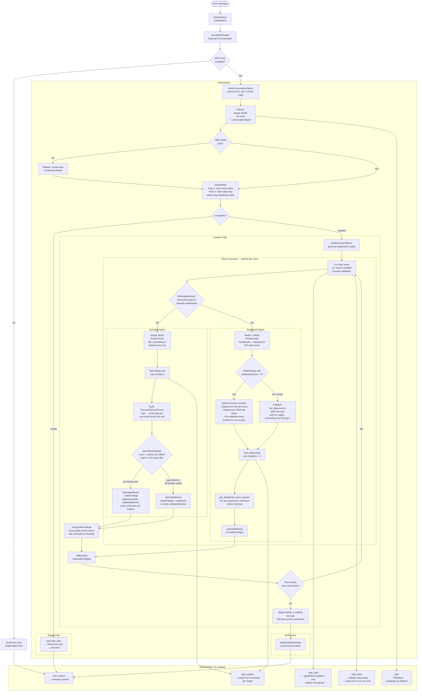

# Graft Multi-Agent Orchestration Flow

## Overview

When a user sends a message in the chat, Graft routes it through a multi-agent
pipeline. The pipeline consists of five components: a **Planner**, one or more
**Specialist** agents, a purpose-built **Dashboard Agent**, a **Synthesiser**,
and the **Orchestrator** that coordinates them all.

For simple requests (single data source, ≤ 2 tool calls), the pipeline short-
circuits to a single-agent loop. For complex requests (multiple data sources,
dashboard creation, or cross-step chaining), the full pipeline runs.

---

## Architecture Diagram



---

## Step-by-Step Explanation

### 1. User Message → ChatInterface

The user sends a message. `handleSend` in `ChatInterface.tsx`:

1. Appends the user message to the conversation history.
2. Calls `truncateMessages(messages, 10)` — keeps at most the last 10
   user/assistant exchanges to stay within the LLM context window.
3. Fetches the current Grafana context (dashboard, user, datasources) and
   formats it into a system prompt string via `formatContext`.
4. Checks whether MCP tools are available (`mcpClient && mcpTools.length > 0`).
   - If no tools: calls `llmService.chat` directly (single-agent loop, no orchestration).
   - If tools available: calls `runOrchestration`.

**Source:** `src/components/features/ChatInterface/ChatInterface.tsx` — `handleSend`

---

### 2. Orchestrator

`runOrchestration` in `orchestrator.ts` is the top-level coordinator.

It receives:
- The truncated message history
- The formatted Grafana context string
- All available MCP tools (already filtered by the user's `ToolsConfig`)
- `modelType` (standard / thinking)
- `maxToolIterations` (from plugin settings, default 50)

It runs four phases sequentially: Plan → Simple or Complex execution → Synthesise.

**Source:** `src/services/agents/orchestrator.ts`

---

### 3. Conversation Digest

Before calling the Planner, the orchestrator calls `buildConversationDigest(messages)`.

This produces a compact summary of recent user/assistant turns (up to last 6,
capped at 500 characters per turn). The current user message is excluded — it
is passed separately as the request. System messages and empty turns are skipped.

**Purpose:** Follow-up requests like *"build a dashboard for monitoring it"* lose
context when the planner only sees the latest message. The digest lets the planner
resolve references like "it", "that service", or "the logs" to the right datasource
from an earlier turn.

**Source:** `src/services/agents/orchestrator.ts` — `buildConversationDigest()`

---

### 4. Planner

**Model:** `llm.Model.BASE` — fast, cheap, no tools.

The planner receives the user's message, the Grafana context, the list of enabled
tool categories, and the conversation digest. It produces a structured `AgentPlan`
as JSON:

```json
{
  "complexity": "complex",
  "reasoning": "Dashboard needs Loki data — run a loki step first.",
  "steps": [
    {
      "id": "step_1",
      "description": "Discover Loki labels and validate log queries",
      "toolCategories": ["loki"],
      "dependsOn": []
    },
    {
      "id": "step_2",
      "description": "Build a logs dashboard using validated queries",
      "toolCategories": ["dashboards"],
      "dependsOn": ["step_1"]
    }
  ]
}
```

**Complexity rules:**

| Complexity | When | What happens next |
|---|---|---|
| `simple` | Single category, ≤ 2 tool calls | Delegates directly to `llmService.chat` |
| `complex` | Multiple categories, chaining, or dashboard creation | Full wave execution |

**Structural rules (prompt-enforced, also code-enforced by `sanitisePlan`):**
- Never produce two steps with the same `toolCategories`.
- Dashboard steps must be separate from data steps and list data steps in `dependsOn`.
- A dashboard displaying logs or metrics **always** needs a preceding data step;
  never emit a lone `["dashboards"]` step for data panels.
- Use the conversation digest to resolve references to prior context.
- Steps with no `dependsOn` can run in parallel.

**Fallback:** If the model returns invalid JSON, the planner falls back to a
single-step `simple` plan using the first enabled category.

**Source:** `src/services/agents/planner.ts`

---

### 5. Plan Sanitiser

`sanitisePlan()` runs as a deterministic code gate between the Planner and
`buildExecutionWaves`. It enforces structural correctness in two passes — no LLM
call, O(n) in the number of steps.

**Pass 1 — Split mixed steps:**

Detects any step where `toolCategories` includes both `'dashboards'` and a data
category (`'loki'`, `'prometheus'`, `'datasources'`), and splits it into two steps
wired by `dependsOn`:

```
BEFORE: { id: "step_1", toolCategories: ["loki", "dashboards"], dependsOn: [] }
AFTER:  { id: "step_1",           toolCategories: ["loki"],       dependsOn: [] }
        { id: "step_1_dashboard", toolCategories: ["dashboards"], dependsOn: ["step_1"] }
```

**Pass 2 — Inject missing data steps:**

Detects any `["dashboards"]` step whose entire `dependsOn` chain contains no
`loki` or `prometheus` step (checked transitively). Without a data ancestor, the
dashboard agent has no validated queries and will guess the datasource incorrectly.

A data step is injected immediately before the dashboard step and wired as its
dependency. The data category is inferred from the step description plus the
conversation text via `inferDataCategoriesForDashboard`:

- Log/Loki keywords → `['loki']`
- Metric/Prometheus keywords → `['prometheus']`
- Both mentioned, or ambiguous → all enabled query categories

```
BEFORE: { id: "step_1", toolCategories: ["dashboards"], dependsOn: [] }  // "build a logs dashboard"
AFTER:  { id: "step_1_data", toolCategories: ["loki"],       dependsOn: [] }
        { id: "step_1",      toolCategories: ["dashboards"], dependsOn: ["step_1_data"] }
```

After either pass modifies the plan, `complexity` is forced to `'complex'` so the
wave executor runs (not the simple path).

**Source:** `src/services/agents/orchestrator.ts` — `sanitisePlan()`, `inferDataCategoriesForDashboard()`

---

### 6. Simple Path

When `complexity === 'simple'`:

1. Emits `step_start` — sets the step description in the UI and flips the
   PlanBlock label from "Planning…" to "View plan".
2. Delegates to `llmService.chat` — the existing single-agent tool-calling loop
   with up to `maxToolIterations` iterations.
3. Within `llmService.chat`, after each iteration:
   - Tool results from that iteration are compressed to a short summary before
     the next LLM call to prevent context explosion.
   - Exception: `get_dashboard_by_uid` and related tools are never compressed
     because their output is used directly as input to `update_dashboard`.
4. If `maxToolIterations` is reached, a user-visible note is appended:
   *"The maximum number of tool call steps was reached…"*
5. After `llmService.chat` resolves, emits `final` so `ChatInterface` writes
   the answer to the message.

**Source:** `src/services/agents/orchestrator.ts`, `src/services/llm.ts`

---

### 7. Complex Path — Wave Execution

The orchestrator builds an execution plan from the `dependsOn` dependency graph
using `buildExecutionWaves`. Steps with no unmet dependencies form a "wave"
and run in parallel via `Promise.allSettled`.

For each wave:
1. Emits `step_start` for each step in the wave.
2. Routes each step:
   - `step.toolCategories.includes('dashboards')` → Dashboard Agent
   - Otherwise → Specialist Agent
3. Runs all steps in the wave concurrently. One step failing never blocks others.
4. Merges `DataFindings` from completed data steps into `collectedFindings`.
5. Emits `step_done` for each completed step (triggers UI collapse).
6. Unlocks the next wave once all current-wave dependencies are resolved.

**Source:** `src/services/agents/orchestrator.ts` — `buildExecutionWaves`, wave loop

---

### 8. Specialist Agent

**Model:** `llm.Model.BASE`  
**Tools:** Scoped to the step's `toolCategories` only (e.g. only Loki tools for
a Loki step). Dashboard and cross-category tools are never available.

The specialist runs an internal tool-calling loop (up to `maxToolIterations`).

**For data steps (loki / prometheus), the system prompt is extended with:**

- **Query validation rules**: the model is instructed to:
  1. Discover real label values (via a broad query or the label-values tool) before
     writing equality matchers like `detected_level="error"`. Never guess values.
  2. Call `query_loki_logs` (or `query_prometheus`) for **every** query it intends
     to output, individually. Omit any query that returns no data.

- A **required JSON output schema**: the specialist must respond with a
  structured `LokiFindings` or `PrometheusFindings` object:

  ```json
  {
    "datasourceUid": "abc123",
    "datasourceName": "Loki",
    "labels": { "service": ["api", "frontend"] },
    "validatedQueries": [
      { "description": "Error rate", "logql": "{service=\"api\", detected_level=\"error\"}" }
    ]
  }
  ```

**Executed-query tracking:** During the tool loop, each successful call to
`query_loki_logs` / `query_prometheus` is recorded in an `ExecutedQueryRecord`
(normalised expr → whether the result was non-empty). This is the ground truth
used by `parseDataFindings`.

**Result compression:** After each iteration, prior tool result messages are
replaced with one-line summaries. This prevents the in-loop context window from
growing unboundedly across many tool calls.

**Prose→JSON recovery:** After the loop, if a data step's response doesn't look
like JSON, a plain follow-up call is made: *"Now output your findings as a JSON
object matching this schema exactly."* No `response_format` field is used — the
Grafana LLM proxy does not support it (would cause HTTP 400). `parseDataFindings`
extracts JSON from the response via fence detection and first-`{`/last-`}` slicing.

**`parseDataFindings` — two-layer validation gate:**

Layer 1 (step-level gate): at least one successful query tool call must exist in
`toolExecutions`. Rejects the entire findings object if the model claimed to
validate but no tool call succeeded.

Layer 2 (per-query filter): each entry in `validatedQueries` is kept only if its
`logql`/`promql` expression was recorded in `ExecutedQueryRecord` **and** that
execution returned non-empty data. Unverified or empty-returning queries are
silently dropped. This prevents the model from padding findings with
plausible-but-unverified narrow queries that produce "No data" panels.

The resulting `validatedQueries` may be empty if all candidate queries were
filtered out. The findings object is still returned (with `datasourceUid` intact)
so the dashboard agent knows the datasource even when no queries survived.

**Source:** `src/services/agents/specialist.ts`

---

### 9. DataFindings Accumulation

After each wave completes, `mergeDataFindings` is called for each result.
This is a last-write-wins shallow merge:

```ts
{
  loki: incoming.loki ?? accumulated.loki,
  prometheus: incoming.prometheus ?? accumulated.prometheus,
}
```

The merged `collectedFindings` is passed to every dashboard step in subsequent
waves. This is the mechanism by which a Loki specialist in wave 1 provides
validated queries and datasource UIDs to a dashboard agent in wave 2.

**Source:** `src/services/agents/orchestrator.ts` — `mergeDataFindings`

---

### 10. Dashboard Agent

**Model:** `llm.Model.LARGE` — stronger structural reasoning for complex JSON.  
**Tools:** Hardcoded to `['dashboards', 'datasources']` only — cannot call any
query tools regardless of what the plan step says.  
**Iteration limit:** `Math.min(maxToolIterations × 2, 100)` — double the
configured limit to accommodate multi-step construction.

#### Happy path — DataFindings with validated queries

The system prompt includes the exact datasource JSON alongside each query:

```
1. Description: Error rate by service
   LogQL expr: {service="api", detected_level="error"}
   Datasource JSON: {"type": "loki", "uid": "abc123"}
```

The agent copies both verbatim into panel targets. No datasource lookup needed.

#### Fallback path — no findings or empty validatedQueries

Triggered when either:
- No data specialist ran upstream (shouldn't happen after `sanitisePlan` Pass 2,
  but treated defensively), or
- All candidate queries were filtered out by the per-query validation gate.

The system prompt's fallback branch instructs the agent to:
1. Call `list_datasources` to discover available datasources and their types.
2. Select the datasource by **type** (not by name or guessed UID):
   - LogQL / log panels → a datasource of type `"loki"`
   - PromQL / metric panels → a datasource of type `"prometheus"`
3. Never attach a LogQL expression to a Prometheus datasource or vice versa.

#### Mandatory post-write verification

After writing all panels, the agent must:
1. Call `get_dashboard_panel_queries` to inspect each panel's datasource type
   against its query expression.
2. **Fix** any mismatch (not just flag it): repoint the panel to the correct
   datasource and call `update_dashboard` again with the corrected target.
3. Re-run `get_dashboard_panel_queries` after corrections to confirm no
   mismatches remain.
4. **Not finish** while any panel's datasource type contradicts its query language.

#### Construction process

1. Create an empty dashboard skeleton (`update_dashboard` with empty panels).
2. Fetch the assigned UID (`get_dashboard_by_uid`) — note the UID immediately
   for the final response link.
3. Build all panels and write them in a single `update_dashboard` call.
4. Verify panel count (`get_dashboard_by_uid`).
5. Run `get_dashboard_panel_queries` and fix any datasource mismatches.

**Source:** `src/services/agents/dashboardAgent.ts`

---

### 11. Synthesiser

**Model:** `llm.Model.BASE` or `llm.Model.LARGE` (inherits `modelType`).  
**Tools:** None.

Receives the prose `summary` from every `SpecialistResult` (not the raw tool
outputs, not `DataFindings`). Combines them into a single coherent user-facing
response.

Failed steps are explicitly surfaced in the prompt so the synthesiser can
report them alongside successful results.

**Post-processing:** `linkifyDashboardUids` scans the output and converts bare
dashboard UIDs to `[Open dashboard](/d/{uid})` markdown links.

**Source:** `src/services/agents/synthesiser.ts`

---

### 12. UI Update Events

The orchestrator emits `OrchestrationUpdate` events throughout execution.
`ChatInterface` handles each type:

| Event | Payload | Handler effect |
|---|---|---|
| `plan` | `AgentPlan` | Renders collapsible `PlanBlock` with "Planning…" label |
| `step_start` | `stepId`, `stepDescription` | Sets `agentPlanComplete = true` (PlanBlock → "View plan"); registers an empty step group in `stepToolExecutions` |
| `step_update` | `stepId`, `toolExecutions[]` | Calls `mergeStepToolExecutions` — replaces only that step's tool entries, leaving all other steps intact. Parallel specialists never overwrite each other. |
| `step_done` | `stepId`, final `toolExecutions[]`, optional `error` | Marks step group as done/error, triggers auto-collapse. If `error` is present and no tool rows exist, the error message is shown in the expandable step body. |
| `final` | `content` | Writes the synthesised answer to the assistant message |

**Source:** `src/components/features/ChatInterface/ChatInterface.tsx` — orchestration callback

---

## Data Flow Summary

```
User message
  → truncateMessages (context window management)
  → formatContext (Grafana dashboard/user/datasources)
  → buildConversationDigest (recent turns for planner context)
  → Planner (AgentPlan with steps and dependency graph)
  → sanitisePlan:
      Pass 1: split mixed steps (["loki","dashboards"] → separate steps)
      Pass 2: inject data step before any lone ["dashboards"] step
  → Wave execution:
      Loki specialist  →  discover real label values first
                       →  execute EVERY query individually, record expr→nonEmpty
                       →  [Layer 1: query tool was successfully called?]
                       →  [Layer 2: per-query filter — keep only confirmed non-empty]
                       →  DataFindings { datasourceUid, validatedQueries (filtered) }
      Prometheus spec  →  [same process]
                       →  DataFindings { datasourceUid, validatedQueries (filtered) }
                       ↓
               mergeDataFindings (collectedFindings)
                       ↓
      Dashboard agent  →  panels with correct datasource UIDs and type
                       →  get_dashboard_panel_queries (post-write verification)
                       →  fix any datasource type mismatches before finishing
  → Synthesiser (prose summaries → final answer)
  → linkifyDashboardUids (UID → clickable link)
  → ChatInterface message
```

---

## Harness Best Practices Applied

Based on Anthropic's *Building Effective Agents* and the OpenAI Agents SDK
guardrails documentation, the following code-enforced gates have been
implemented. The key principle:

> *"The tell that you should be using tools: if you're writing a regex to extract
> a decision from model output, that decision should have been a tool call.
> Parsing free-form text to recover structured intent is a sign the structure
> belongs in the schema."* — Anthropic

### Prompt-only vs. code-enforced constraints

| Constraint | Enforcement level | Where |
|---|---|---|
| Plan separation (loki ≠ dashboards in same step) | Code gate | `sanitisePlan()` Pass 1 |
| Data step before dashboard step | Code gate | `sanitisePlan()` Pass 2 |
| Conversation context for follow-up requests | Code (always runs) | `buildConversationDigest()` |
| Query tool was called at least once | Code gate | `parseDataFindings()` Layer 1 |
| Each output query was individually executed and non-empty | Code gate | `parseDataFindings()` Layer 2 — `ExecutedQueryRecord` |
| Model discovers real label values before writing matchers | Prompt rule | `buildDataOutputNote()` |
| Post-write datasource type check | Mandatory agent instruction | Dashboard agent system prompt |
| Datasource mismatch must be fixed, not just flagged | Mandatory agent instruction | Dashboard agent "When you are done" |

---

## Implemented Fixes

### Fix 1 — Plan sanitiser (`orchestrator.ts`)

`sanitisePlan()` is a deterministic code gate between the Planner and
`buildExecutionWaves`. It runs in two passes:

**Pass 1 — Split mixed steps.** Detects any step where `toolCategories` includes
both `'dashboards'` and a data category, and splits it:

```
BEFORE: { id: "step_1", toolCategories: ["loki", "dashboards"], dependsOn: [] }
AFTER:  { id: "step_1",           toolCategories: ["loki"],       dependsOn: [] }
        { id: "step_1_dashboard", toolCategories: ["dashboards"], dependsOn: ["step_1"] }
```

**Pass 2 — Inject missing data steps.** Detects any lone `["dashboards"]` step
with no query-data ancestor in its transitive dependency chain, and injects a
preceding data step. The data category is inferred by keyword heuristic from the
step description and conversation text:

```
BEFORE: { id: "step_1", toolCategories: ["dashboards"], dependsOn: [] }
AFTER:  { id: "step_1_data", toolCategories: ["loki"],       dependsOn: [] }
        { id: "step_1",      toolCategories: ["dashboards"], dependsOn: ["step_1_data"] }
```

This is the "poka-yoke" pattern — constraining the input space so mistakes are
structurally impossible, regardless of what the Planner emits.

**Source:** `src/services/agents/orchestrator.ts` — `sanitisePlan()`, `inferDataCategoriesForDashboard()`

---

### Fix 2 — Conversation-aware planner (`orchestrator.ts`, `planner.ts`)

`buildConversationDigest()` builds a compact summary of recent user/assistant
turns (last 6, capped 500 chars each, current request excluded). This is injected
into the planner prompt under "Recent conversation — use this to resolve references
in the request."

Prevents the planner from losing context on follow-up requests like *"build a
dashboard for monitoring it"* and emitting a lone `["dashboards"]` step because
it doesn't know what "it" refers to.

**Source:** `src/services/agents/orchestrator.ts` — `buildConversationDigest()`

---

### Fix 3 — Per-query validation gate (`specialist.ts`)

Two layers of code-enforced validation prevent unverified queries from reaching
the dashboard agent and producing "No data" panels:

**Layer 1 — Step-level gate (existing):** `parseDataFindings()` checks
`toolExecutions` to confirm the query tool was called at least once successfully:

```ts
const queryToolWasCalled = toolExecutions.some(
    t => t.name === requiredTool && t.status === 'success'
);
if (!queryToolWasCalled) { return undefined; }
```

**Layer 2 — Per-query filter (new):** During the tool loop, an `ExecutedQueryRecord`
is built: normalised expr → whether the result was non-empty. `parseDataFindings`
then filters each entry in `validatedQueries`:

```ts
// Keep only queries that were executed AND returned data
const filteredQueries = validatedQueries.filter(q => {
    const nonEmpty = executedQueries.get(normaliseExpr(q.logql));
    return nonEmpty === true; // undefined = never ran; false = ran but empty
});
```

This implements the Anthropic principle that the harness's own execution record
is the authoritative signal — not the model's prose claims. A model that outputs
`detected_level="error"` in findings without having run that exact expression
against Loki is rejected at the code level.

**Source:** `src/services/agents/specialist.ts` — `parseDataFindings()`, `ExecutedQueryRecord`

---

### Fix 4 — Removed unsupported `response_format` (`specialist.ts`)

The prose→JSON recovery follow-up call previously used
`response_format: { type: 'json_object' }`, passed via `as any`. The Grafana LLM
proxy does not support this field (it is absent from `ChatCompletionsRequest` in
`@grafana/llm`) and returns HTTP 400, causing the data step to fail with no
diagnostics in the UI.

The field has been removed. The follow-up is now a plain `chatCompletions` call.
`parseDataFindings`'s existing extraction (fence detection + first-`{`/last-`}`)
handles the response without API-level enforcement.

**Source:** `src/services/agents/specialist.ts` — post-loop follow-up call

---

### Fix 5 — Mandatory dashboard self-correction (`dashboardAgent.ts`)

The dashboard agent's post-write verification step is now mandatory and
self-correcting, not advisory:

- If `get_dashboard_panel_queries` shows a panel using a `"prometheus"` datasource
  with a LogQL expression, the agent must **fix it** (repoint to a Loki datasource,
  call `update_dashboard`) and re-verify.
- The agent must not finish while any panel's datasource type contradicts its
  query language.

**Source:** `src/services/agents/dashboardAgent.ts` — system prompt, "When you are done"

---

### Fix 6 — Step error surfacing in the UI

Previously, a step that failed before making any tool calls (e.g. an HTTP 400 from
the LLM API) would show the "✗ error" indicator in the step header but reveal
nothing when expanded, because `toolExecutions` was empty.

The fix threads the error string end-to-end:
- `result.error` is included in the `step_done` `OrchestrationUpdate` event.
- `StepToolExecutions` carries an optional `error` field.
- `ChatInterface` sets `hasError = true` when `update.error` is present.
- `StepToolCallContainer` renders `group.error` (or *"Step failed with an unknown
  error."*) in the expandable body when the step is error-status with no tool rows.

**Source:** `src/services/agents/types.ts`, `src/types/llm.types.ts`,
`src/services/agents/orchestrator.ts`, `src/components/features/ChatInterface/ChatInterface.tsx`,
`src/components/features/ChatInterface/components/StepToolCallContainer.tsx`

---

## Known Issues

### 1. Planner rule violation → empty DataFindings

~~The planner sometimes produces `["loki", "dashboards"]` in a single step,
violating the structural rule that separates data querying from dashboard
construction.~~

**Fixed** by `sanitisePlan()` Pass 1 in `orchestrator.ts`. Mixed steps are
deterministically split before execution regardless of what the Planner emits.

### 2. Follow-up requests lose conversation context

~~A follow-up message like "build a dashboard for monitoring it" reaches the
planner with only the last user message, causing the planner to emit a lone
`["dashboards"]` step with no data dependency.~~

**Fixed** by two independent mechanisms:
- `buildConversationDigest()` injects recent turns into the planner prompt (Fix 2).
- `sanitisePlan()` Pass 2 injects the missing data step as a structural fallback
  regardless of what the planner outputs (Fix 1).

### 3. Query validation is prompt-based, not code-enforced

~~The specialist is instructed to call `query_loki_logs` before including a
query in its output. There is no code check that this happened. The model can
output queries it validated once, and pad findings with unverified narrow queries
(e.g. `detected_level="error"`) that return no data.~~

**Fixed** by the two-layer validation gate in `parseDataFindings()` (Fix 3):
Layer 1 rejects findings when no query tool was called; Layer 2 filters individual
queries against the `ExecutedQueryRecord`, keeping only expressions that were
actually run and returned non-empty data.

### 4. Dashboard agent cannot re-validate queries

The Dashboard Agent has no query tools and cannot independently verify that
the expressions it receives in `DataFindings` actually return data. It relies
entirely on the specialist's output.

This is correct by design (tool scope restriction prevents context explosion).
Fix 3's per-query filter addresses the upstream validation quality. The mandatory
post-write verification (Fix 5) provides structural confirmation that the written
JSON is consistent (correct datasource type for each query language), but cannot
confirm that queries return data at runtime.
